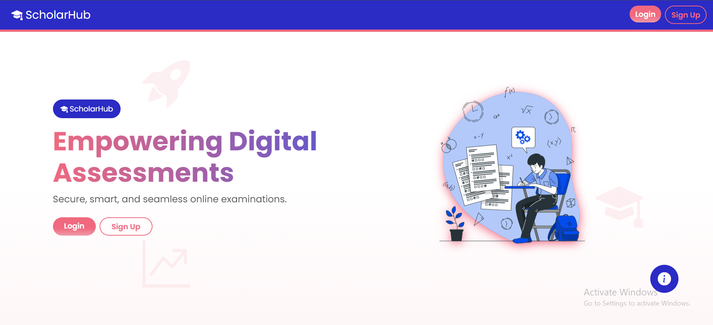
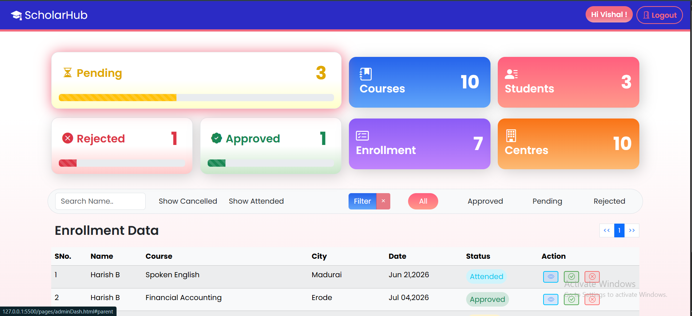
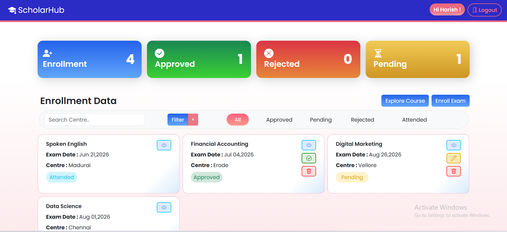

# ScholarHub

A responsive **Online Examination Enrollment Management System** developed using **HTML5, CSS3, Bootstrap 5, JavaScript (ES6 Modules), jQuery, and JSON Server**.

ScholarHub allows students to register, enroll for examinations, track their application status, and manage their exam applications. Administrators can approve or reject applications, monitor statistics, manage enrollment records, and oversee the entire examination process.

---

# Table of Contents

* [Overview](#overview)
* [Features](#features)
* [Technology Stack](#technology-stack)
* [Project Structure](#project-structure)
* [Database Collections](#database-collections)
* [Application Workflow](#application-workflow)
* [Authentication](#authentication)
* [Dashboard Features](#dashboard-features)
* [Enrollment Workflow](#enrollment-workflow)
* [Validation](#validation)
* [REST API Endpoints](#rest-api-endpoints)
* [Installation](#installation)
* [Project Highlights](#project-highlights)
* [Future Enhancements](#future-enhancements)
* [Learning Outcomes](#learning-outcomes)

---

# Overview

ScholarHub is designed to simplify the examination enrollment process by providing separate dashboards for **Students** and **Administrators**.

Students can:

* Register
* Login
* Browse available examinations
* Apply for examinations
* Track application status
* Edit pending applications
* Reapply rejected applications
* Cancel applications
* Mark examinations as attended

Administrators can:

* View all student enrollments
* Approve applications
* Reject applications with reasons
* Restore deleted records
* Permanently delete applications
* View statistics
* Search and filter enrollments

The application communicates with a JSON Server backend using REST APIs.

---

# Features

## Student Module

* Student Registration
* Student Login
* View Available Courses
* Enroll for Examination
* Select Test Centre
* Choose Preferred Date
* View Enrollment Status
* Update Pending Applications
* Reapply Rejected Applications
* Cancel Enrollment
* Mark Examination as Attended
* Search Applications
* Filter Applications
* Dashboard Statistics
* View Profile Information

---

## Administrator Module

* Administrator Login
* Dashboard Statistics
* View Student Enrollments
* Approve Applications
* Reject Applications
* View Rejection Reason
* Restore Deleted Records
* Permanently Delete Records
* View Students
* View Courses
* Search Enrollments
* Filter by Course
* Filter by Date
* Pagination
* Progress Bars
* Dashboard Analytics

---

# Technology Stack

## Frontend

* HTML5
* CSS3
* Bootstrap 5
* Bootstrap Icons
* JavaScript (ES6 Modules)
* jQuery

---

## Libraries

* SweetAlert2
* Toastr

---

## Backend

* JSON Server

---

## Storage

* Local Storage (Session Management)

---

# Project Structure

```text
ScholarHub
│
├── assets/
│   └── images/
│
├── pages/
│   ├── index.html
│   ├── adminDash.html
│   ├── studentDash.html
│   ├── coursePage.html
│   └── userPage.html
│
├── scripts/
│   ├── api.js
│   ├── index.js
│   ├── adminDash.js
│   ├── studentDash.js
│   ├── coursePage.js
│   └── userPage.js
│
├── styles/
│   └── index.css
│
├── db.json
│
└── README.md
```

---

# Screenshots 





---

# Database Collections

## Users

Stores login and profile information.

| Field          | Description        |
| -------------- | ------------------ |
| id             | Unique Identifier  |
| name           | Student/Admin Name |
| email          | Email Address      |
| password       | Login Password     |
| role           | Student/Admin      |
| gender         | Gender             |
| dob            | Date of Birth      |
| college        | College Name       |
| departmentName | Department         |
| mobile         | Mobile Number      |

---

## Department

Stores all available departments.

Example:

* Information Technology
* Business & Marketing
* Creative Arts
* Language & Communication
* Professional Skills

---

## Course

Stores examination details.

Each course contains:

* Course ID
* Course Name
* Department
* Description
* Fees
* Image

---

## Test Centre

Stores available examination centres.

---

## Enrollment

Stores every examination application.

Each enrollment contains:

* Student Details
* Course
* Department
* Test Centre
* Preferred Date
* Fees
* Status
* Rejection Reason
* Deleted State
* Updated Date

---

# Application Workflow

## Student Workflow

```text
Register
    │
    ▼
Login
    │
    ▼
Student Dashboard
    │
    ▼
Browse Courses
    │
    ▼
Apply for Examination
    │
    ▼
Pending
    │
    ▼
Admin Review
    │
    ├────────► Approved
    │               │
    │               ▼
    │         Attend Examination
    │               │
    │               ▼
    │           Completed
    │
    └────────► Rejected
                    │
                    ▼
                Reapply
```

---

## Admin Workflow

```text
Login
   │
   ▼
Dashboard
   │
   ▼
View Applications
   │
   ▼
Approve / Reject
   │
   ▼
Statistics Updated
```

---

# Authentication

The application supports **Role-Based Authentication**.

Available Roles:

* Admin
* Student

After successful login:

```text
Admin
   │
   ▼
Admin Dashboard

Student
   │
   ▼
Student Dashboard
```

User session is maintained using:

```javascript
localStorage.setItem("user", JSON.stringify(data));
```

---

# Dashboard Features

## Student Dashboard

Displays:

* Total Applications
* Pending
* Approved
* Rejected

Allows:

* Search
* Filters
* Update
* Cancel
* Reapply
* Mark Attended

---

## Admin Dashboard

Displays:

* Total Students
* Total Courses
* Total Centres
* Total Enrollments

Includes:

* Progress Bars
* Search
* Filter
* Pagination
* Approval Actions
* Restore Records
* Permanent Delete

---

# Enrollment Workflow

Each enrollment moves through different stages.

```text
Pending
   │
   ├────────► Approved
   │               │
   │               ▼
   │          Attended
   │
   └────────► Rejected
                   │
                   ▼
               Reapply
```

---

# Validation

The application performs client-side validation for:

* Name
* Email
* Password
* Confirm Password
* Mobile Number
* Date of Birth
* Gender
* Required Fields

Regular Expressions are used for:

* Email Validation
* Password Validation
* Mobile Number Validation
* Name Validation

Bootstrap validation classes are used:

```text
is-valid
is-invalid
```

---

# REST API Endpoints

| Method | Endpoint      | Description       |
| ------ | ------------- | ----------------- |
| GET    | `/users`      | Fetch Users       |
| POST   | `/users`      | Register Student  |
| GET    | `/department` | Fetch Departments |
| GET    | `/course`     | Fetch Courses     |
| GET    | `/testCentre` | Fetch Centres     |
| GET    | `/enroll`     | Fetch Enrollments |
| POST   | `/enroll`     | Create Enrollment |
| PATCH  | `/enroll/:id` | Update Enrollment |
| DELETE | `/enroll/:id` | Delete Enrollment |

---

# Installation

## Clone Repository

```bash
git clone https://github.com/your-username/ScholarHub.git
```

---

## Install JSON Server

```bash
npm install -g json-server
```

---

## Start JSON Server

```bash
json-server --watch json/db.json
```

Server runs at:

```
http://localhost:3000
```

---

## Open Project

Run the project using **Live Server** in Visual Studio Code.

---

# Project Highlights

* Role-Based Authentication
* Responsive UI
* REST API Integration
* CRUD Operations
* Soft Delete & Restore
* Pagination
* Search Functionality
* Dynamic Filtering
* Progress Dashboard
* Statistics Cards
* Local Storage Authentication
* Bootstrap Modals
* SweetAlert Confirmations
* Toastr Notifications
* Dynamic DOM Rendering
* Event Delegation
* Form Validation
* ES6 Modules

---

# Future Enhancements

* JWT Authentication
* Password Encryption
* Node.js Backend
* Express.js APIs
* MongoDB Database
* Online Payment Gateway
* Email Notifications
* Examination Result Module
* Certificate Generation
* Admin Reports
* Analytics Charts
* Student Profile Picture Upload
* Online Examination Portal

---

# Learning Outcomes

This project demonstrates practical knowledge of:

* HTML5
* CSS3
* Bootstrap 5
* JavaScript ES6
* jQuery
* JSON Server
* REST APIs
* Fetch API
* CRUD Operations
* Client-side Validation
* Local Storage
* Event Delegation
* Pagination
* Filtering
* Search Functionality
* Dashboard Design
* Responsive Web Development
* Role-Based Access Control
* State Management
* Dynamic UI Rendering

---

# Author

**Vishal Manivannan**

---


